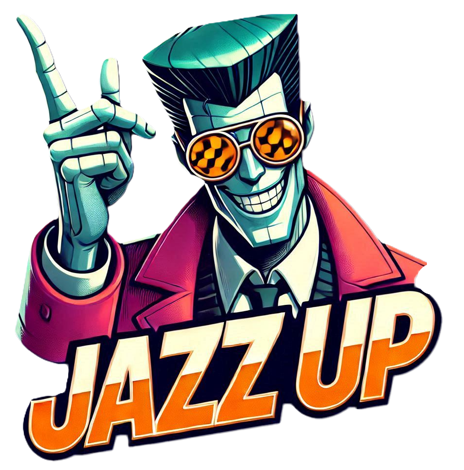
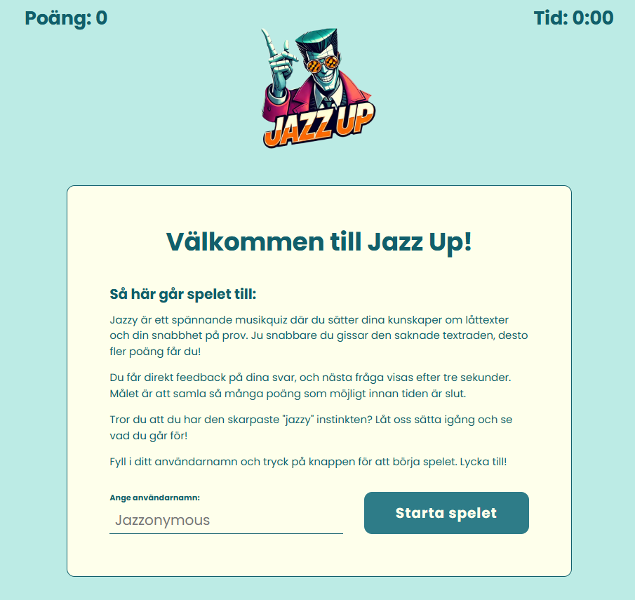
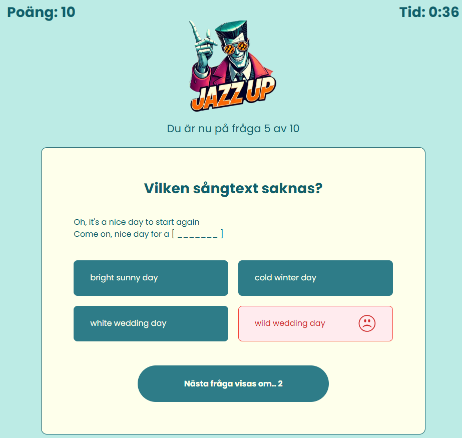
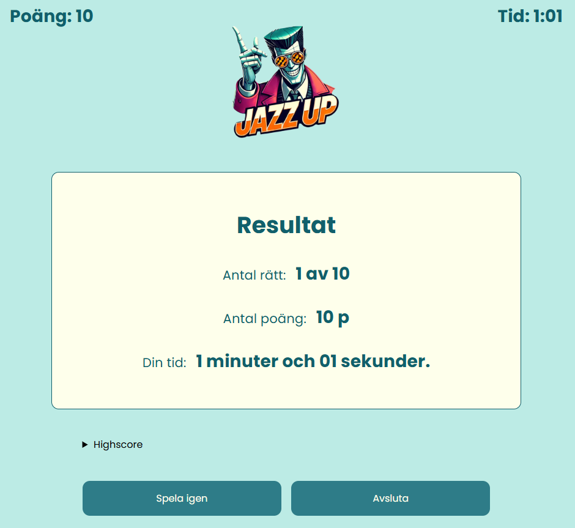
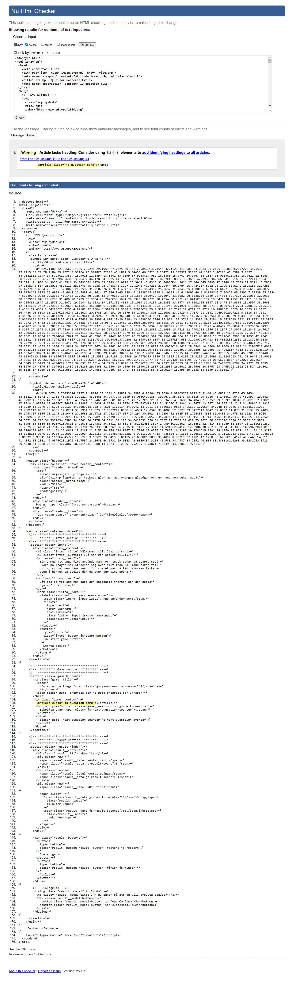
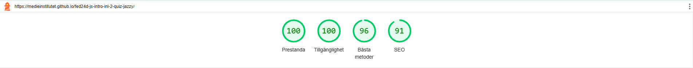

 

# Quiz-spel - Grupparbete i Scrum

Det här projektet är ett quiz-spel som utvecklats som en del av vårt första grupparbete i skolan. Totalt var projektet på 4 veckor. Projektet genomfördes enligt agila principer med hjälp av ramverket Scrum. Syftet var att inte bara skapa ett roligt och engagerande spel, utan också att lära oss om projektledning, samarbete och arbetsmetoder inom agila utvecklingsmiljöer.

## Kravlistan
#### Startsida
Spelet skulle innehålla en startsida med instruktioner och en knapp för att starta spelet. Det skulle även finnas ett fält för att kunna ange ett användarnamn.

#### Frågor
Spelet skulle innehålla minst 20 frågor med tre eller fler svarsalternativ. Vid varje spelomgång skulle 10 frågor slumpas fram, vilket säkerställde variation mellan omgångarna. Under spelets gång skulle även spelaren få en visuell återkoppling som tydligt indikerade om ett svar var rätt eller fel.

#### Poäng & timer
Spelaren skulle tilldelas poäng för varje korrekt svar, och snabbhet skulle belönas med bonuspoäng. Spelet skulle också ha en timer som började räkna uppåt när spelet startas och stannade när den sista frågan var besvarad. 

#### Resultat
Efter avslutad spelomgång skulle antalet korrekta svar, den totala poängen samt tiden det tog att slutföra spelet presenteras på en resultatsida. 

## Författare
[Egil Eskilsson](https://github.com/bluemountain3d)

[Frida Nordenlöw](https://github.com/fridanordenlow)

[Therese Nielsen](https://github.com/thnielseen)

[Elin Nilsson](https://github.com/webbelin)

[Angelica Nylander](https://github.com/angien90)

## Scrum
Vi följde Scrum-metoden och delade in projektet i sprintar.

#### Produktägare
Angelica Nylander, Egil Eskilsson, Elin Nilsson, Frida Nordenlöw och Therese Nielsen

#### Scrum Master
Rollen delas upp över de olika sprintarna så att de flesta fick testa på rollen. Angelica Nylander var Scrum Master 16:e till 23:e december, Elin Nilsson var Scrum Master 23:e december till 3:e januari och
Frida Nordenlöw var Scrum Master 3:e till 10:e januari.

#### Utvecklingsteam
Angelica Nylander, Egil Eskilsson, Elin Nilsson, Frida Nordenlöw och Therese Nielsen

#### Stakeholders 
Maria Larsson Bovin, Jenni Pulli och Jenny Waller

#### Gruppkontrakt
För att säkerställa ett effektivt och harmoniskt samarbete inom gruppen skapade vi ett gruppkontrakt. Detta kontrakt innehöll bland annat överenskommelser kring arbetsfördelning, kommunikation och konflikthantering. Det hjälpte oss att hålla fokus på våra mål och arbeta tillsammans på ett strukturerat sätt. 

#### Sprintar
Vi delade upp projektet i två sprintar. 

Starta spelet - Under denna sprint lade vi grunden för projektet genom att utveckla spelflödet, designa användargränssnittet och skapa de grundläggande modulerna. Sprinten varade i en vecka

Spela spelet - Den andra sprinten fokuserade på att implementera spelets olika funktionaliteter och finslipa dess mekanik. Denna sprint sträckte sig över tre veckor.

#### Backlog & Sprintplanering
Vår backlog och sprint planering gjordes i programmet GitHub Projects. Under varje standup togs en printbild så vi kunde följa utvecklingen i projektet.

#### Dagliga möten
Vi genomförde dagliga standup-möten för att synkronisera vårt arbete, dela med oss av framsteg och lyfta eventuella utmaningar. Dessa möten bidrog till att hålla teamet uppdaterat och möjliggjorde snabba lösningar på problem.

#### Demo
Vi fick efter sprint 1 demonstrera sprintens resultat för stakeholders. Där hade de möjlighet att ge feedback som vi kunde planera in i sprint 2.

#### Retrospektiv
Efter varje sprint höll vi retrospektiva möten med hjälp av verktyget Miro. Där utvärderade vi vårt arbete och diskuterade vad som fungerade bra och identifierade områden för förbättring. Denna process hjälpte oss att ständigt utvecklas och anpassa vårt arbetssätt.

## Design
En wireframe till projektet togs fram med hjälp av Figma innan arbetet startade. 

### Spelets logotype
Loggan togs fram med hjälp av AI.

### Textstil
I quizet använder vi textstiler från GoogleFonts:

- Poppins-Bold
- Poppins-Regular
  
### Färgreferenser
| Color               | Hex                                                               |
| ------------------- | ----------------------------------------------------------------- |
| Bakgrundsfärg       |  `#bcebe5` |
| Kortfärg & textfärg |  `#feffeb` |
| Textfärg            |  `#115f6b` |
| Knappfärg           |  `#2e7c88` |
| Hover färg          |  `#c83a84` |

## Resultat
### Startsidan
På spelets första sida finns en kort beskrivning av spelet, möjlighet att ange ett användarnamn, samt en knapp för att starta spelet.

### Spelsidan
När spelet startar börjar en timer räkna uppåt i övre delen av skärmen. Under spelets gång får man visuell feedback på om man svarat rätt eller fel på frågorna. Vid rätt svar belönas man med poäng baserat på hur snabbt svaret gavs. På denna sida kan man också följa hur många frågor som besvarats och hur många som återstår i omgången.

### Resultatsidan
När den sista frågan har besvarats stoppas timern och resultatsidan visas. Här presenteras en sammanställning över antal rätta svar, den totala poängsumman och tiden det tog att genomföra spelet. På resultatsidan kan man välja att spela igen eller avsluta spelet.

## Installationer
I detta projekt gjordes följande installationer. 

    
## Teknikstack
I detta projekt använde vi oss av;

## Screenshots
Validering och analysverktyg säkerställer att HTML, CSS och JavaScript följer standarder och riktlinjer som fastställts av organisationer som W3C (World Wide Web Consortium). Med nedan valideringar och analyser säkerställer vi att spelet håller bästa möjliga kvalité. 

#### Validering HTML

#### Validering CSS

#### Lighthouse analys

